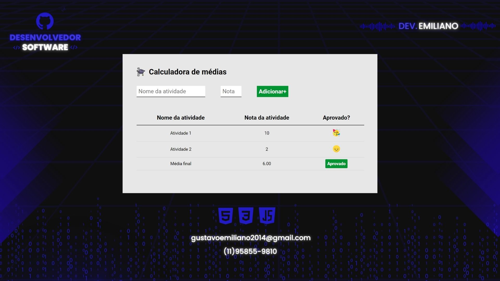

      

# **Calculadora de Média**

Bem-vindo ao repositório do projeto **Calculadora de Médias**! Este projeto foi desenvolvido para praticar os conceitos de HTML, CSS e JavaScript aprendidos no curso **Full Stack Python da EBAC - Escola Britânica de Artes Criativas e Tecnologia**.

## **🔖 Descrição do Projeto**

A Calculadora de Média é uma aplicação web interativa que permite aos usuários adicionar tarefas com suas respectivas notas, calcular a média dessas notas e retornar se o aluno foi aprovado ou reprovado. O projeto foi pensado nos mínimos detalhes, com cuidado para evitar a inserção de atividades duplicadas e garantir que as notas estejam entre 0 e 10. Além disso, os usuários podem definir o valor da nota mínima para a média.

 <h1 align="center">
  
</h1>

## **:mag_right: Funcionalidades**

- Adicionar tarefas com suas respectivas notas.
- Evitar atividades duplicadas.
- Garantir que a nota mínima seja 0 e a máxima seja 10.
- Definir o valor da nota mínima para a média.
- Calcular a média das notas inseridas.
- Exibir a média calculada na tela.
- Design interativo.

## **:bar_chart:Tecnologias Utilizadas**

- :  Utilizado para estruturar a página web.
- : Utilizado para estilizar a interface do usuário.
- : Utilizado para a lógica de cálculo da média e manipulação do DOM.

## **:open_file_folder: Instalação e Utilização**

1. Clone este repositório para sua máquina local usando `git clone https://github.com/GustavoEmiliano/projeto_calculadora_medias.git`.
2. Navegue até o diretório clonado e abra no VSCode.
3. Instale a extensão Live Server no VSCode. (https://github.com/ritwickdey/vscode-live-server-plus-plus)
4. Clique em Go Live no canto inferior direito do VSCode para executar o projeto no browser.
3. Insira as tarefas e suas respectivas notas.
4. Defina a nota mínima para a média, se necessário.
5. Clique no botão para calcular a média.

 ## **:computer: Deploy** 

 **Link**: https://emiliano-projeto-calculadora-medias.vercel.app/

## **📝 License**

Licensed under the [MIT License](./LICENSE).

## **:octocat: Contribuições** 

Contribuições são bem-vindas! Se você tiver sugestões ou melhorias, sinta-se à vontade para abrir uma issue ou enviar um pull request.

## **✒️ Contato**

Se você tiver alguma dúvida ou precisar de mais informações, entre em contato comigo:

- Nome: Gustavo Emiliano de Jesus dos Santos
- Email: <a href="mailto:gustavoemiliano2014@gmail.com">gustavoemiliano2014@gmail.com</a>

Obrigado por visitar o repositório da Calculadora de Média!

---

Gustavo Emiliano - &copy; 2024

